<picture>
  <source media="(prefers-reduced-motion: reduce)" srcset="assets/dashboard-header-static.svg">
  
</picture>

  
  
  

  

## ⚡ About Me

Backend Developer from **Colombia** 🇨🇴 and **Systems Engineering** student at **UDES** (8th semester). I design robust APIs and concurrent systems with **Python, Java and TypeScript** — and I enjoy taking projects end-to-end, from database to deployed service.

- 🔭 Focused on **backend architecture, APIs and distributed systems**
- 🛠️ Full-stack breadth: I build the frontend too when the product needs it
- 🤖 Currently exploring **AI agents and LLMOps**
- 📫 Reach me through **[LinkedIn](https://www.linkedin.com/in/heberyesid/)** or my **[portfolio](https://portfolio-heber-dazas-projects.vercel.app/)**

## 📊 System Metrics

  
  

  

## 🐍 Contribution Grid

  

## 🧩 Tech Stack

  <b style="color:#00E5FF">LANGUAGES</b> 
  

  <b style="color:#39FF14">BACKEND</b> 
  

  <b style="color:#00E5FF">FRONTEND</b> 
  

  <b style="color:#FF7A00">DATA</b> 
  

  <b style="color:#39FF14">CLOUD &amp; TOOLS</b> 
  

## 🚀 Featured Projects

<table align="center">
  <tr>
    <td width="33%" align="center">
      <b>🥊 <a href="https://github.com/HeberYesid/code-duel">code-duel</a></b> 
      Real-time competitive coding platform with an isolated, containerized code execution engine. 
      <code>Java 21</code> <code>Spring Boot</code> <code>JWT</code> <code>PostgreSQL</code> <code>Docker</code> 
      <a href="https://github.com/HeberYesid/code-duel">Repo</a>
    </td>
    <td width="33%" align="center">
      <b>📜 <a href="https://github.com/HeberYesid/Certificados">Certificados</a></b> 
      All my credentials: AWS, Docker, Java, Python, Spring Framework, design patterns, AI and more. 
      <code>AWS</code> <code>Spring</code> <code>Python</code> <code>AI</code> <code>English</code> 
      <a href="https://github.com/HeberYesid/Certificados">Repo</a>
    </td>
    <td width="33%" align="center">
      <b>⚙️ <a href="https://github.com/HeberYesid/concurrent-scheduler-lab">concurrent-scheduler-lab</a></b> 
      Concurrent process scheduler with dynamic priority and aging — binary max-heap, JMH benchmarks up to 500k processes. 
      <code>Java 17</code> <code>Concurrency</code> <code>JMH</code> <code>jqwik</code> <code>Docker</code> 
      <a href="https://github.com/HeberYesid/concurrent-scheduler-lab">Repo</a> · <a href="https://concurrent-scheduler-lab.onrender.com">Live</a>
    </td>
  </tr>
  <tr>
    <td width="33%" align="center">
      <b>🔍 <a href="https://github.com/HeberYesid/jobsearch">jobsearch</a></b> 
      AI-assisted job search framework — scrapes postings, evaluates fit across 7 dimensions, drafts LaTeX CVs and ATS-checks them. 
      <code>TypeScript</code> <code>Bun</code> <code>AI</code> <code>LaTeX</code> <code>CI</code> 
      <a href="https://github.com/HeberYesid/jobsearch">Repo</a>
    </td>
    <td width="33%" align="center">
      <b>📈 <a href="https://github.com/HeberYesid/investment-tracker">investment-tracker</a></b> 
      Mobile-first investment tracker — Next.js app on Supabase with auth, RLS and scheduled market-data sync. 
      <code>Next.js</code> <code>Supabase</code> <code>PostgreSQL</code> <code>Edge Functions</code> 
      <a href="https://github.com/HeberYesid/investment-tracker">Repo</a> · <a href="https://investment-tracker-xi-seven.vercel.app">Live</a>
    </td>
    <td width="33%" align="center">
      <b>🎓 <a href="https://github.com/HeberYesid/AulaAlDia-frontend">AulaAlDia-frontend</a></b> 
      Frontend of a full-stack educational platform — 3 roles, 400+ commits, unit, integration and e2e tested. 
      <code>React 18</code> <code>Vite</code> <code>Vitest</code> <code>Playwright</code> <code>Vercel</code> 
      <a href="https://github.com/HeberYesid/AulaAlDia-frontend">Repo</a> · <a href="https://aula-al-dia-frontend.vercel.app">Live</a>
    </td>
  </tr>
</table>

## 📡 Connect

  
  
  

  

